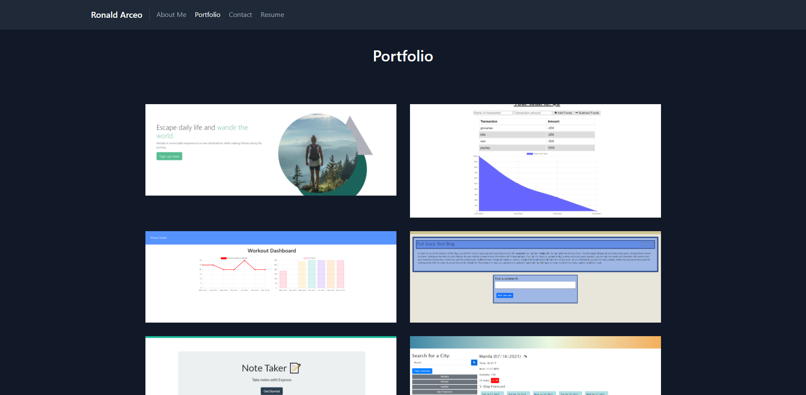

# React Portfolio
            
## Description
This portfolio was built using React. It shows potential employers my previous projects, links to the deployed applications and Github repositories, information about me, a contact form, and a page where they can view or download my resume.

This project was bootstrapped with [Create React App](https://github.com/facebook/create-react-app).

## Table of Contents
* [Screenshot](#screenshot)
* [License](#license)
* [Link to Portfolio](#link)
* [Questions](#questions)            

## Screenshot

## License
Licensed under The MIT License
            
## Link
https://ronarceo.github.io/React-Portfolio/
            
## Questions
Github: https://github.com/ronarceo

Email: ronaldmarceo@gmail.com